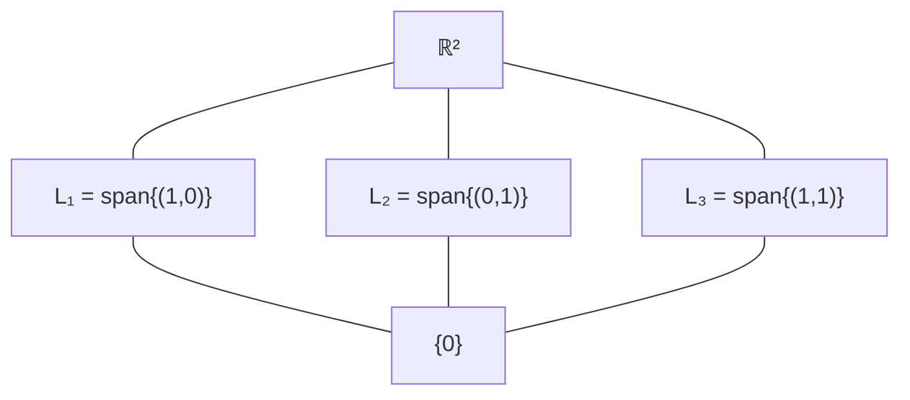

§1.1 에서 큰 무대를 마련했다. 이제 그 무대 *안*을 들여다본다.

---

평면 $\mathbb{R}^2$ 안에 원점을 지나는 직선을 하나 그려 보자. 이 직선 위의 두 화살표를 더해도 직선을 빠져나가지 않고, 한 화살표에 실수를 곱해도 직선 안에 머문다. 곧 작은 직선 하나가 평면 안에서 *그 자체로 작은 1차원(dimension) 벡터공간(vector space)* 처럼 행동한다.

이런 식으로 *큰 공간 안에 깃든 작은 공간*을 **부분공간(subspace)** 이라 부른다. 앞으로 만들 거의 모든 구조가 부분공간 위에서 시작한다. 핵·상 (§2), 고유공간 (§5), 불변부분공간(invariant subspace) (§6), 표준형의 직합(direct sum) 분해 (§7), 이차형식의 정부호 부분공간 (§8) — 모두 이 한 개념의 변주다.

---

## §1.2.1 V 안의 작은 V

부분공간이란 "$V$ 안에 들어 있는, 그 자체로 벡터공간인 부분집합"이다. 그렇다고 *아무* 부분집합이나 부분공간이 되는 것은 아니다. 두 가지를 만족해야 한다 — 덧셈과 스칼라곱이 밖으로 새 나가지 않아야 하고, 영벡터를 품어야 한다.

이 둘이 왜 필요한지를 그림 한 장으로 보자. $\mathbb{R}^2$ 의 부분공간은 정확히 셋 종류다.

*그림 1.2.0. $\mathbb{R}^2$ 의 부분공간(subspace) — 영부분공간(zero subspace) $\{0\}$, 원점을 지나는 직선들, 그리고 $\mathbb{R}^2$ 자신뿐이다.*

이 그림이 알려 주는 두 가지 사실을 짚어 두자.

**첫째, *원점을 반드시 지나야 한다*.** 원점을 지나지 않는 직선은 부분공간이 *아니다* — 영벡터(zero vector)가 빠지기 때문이다. 평면 위에서 원점을 지나지 않는 직선은 *아핀 부분공간(affine subspace)* 이라 따로 부르고 부분공간과 구분한다.

이 차이가 처음에는 사소해 보일 수 있다. 그러나 가우스 소거법에서 *비동차* 방정식 $Ax = b$ ($b \neq 0$) 의 해집합이 등장할 때, 그 해집합은 *아핀 부분공간*이다 — 그래서 부분공간만의 도구로는 직접 다룰 수 없고, 한 번 *평행이동*해서 동차 문제로 끌어와야 한다. 이 구분이 그 자리에서 살아난다.

**둘째, $\mathbb{R}^2$ 의 부분공간은 *차원(dimension)*이라는 한 가지 잣대로 분류된다.** 0차원 ($\{0\}$ 하나뿐), 1차원 (직선 무한히 많음), 2차원 ($\mathbb{R}^2$ 자신 하나뿐). 더 일반적으로 $n$ 차원 공간 $\mathbb{R}^n$ 은 0차원부터 $n$ 차원까지의 부분공간들로 *층층이* 쌓여 있다.

차원(dimension)이라는 개념이 §1.5 에서 정식으로 정의되기 전까지는, 이 한 그림을 머릿속에 두고 가자.

---

## §1.2.2 부분공간 판정법(subspace test)

부분집합 $W$ 가 부분공간인지 어떻게 효율적으로 확인할까? 원리적으로는 8공리를 다시 검사해야 한다. 그런데 (V1) 결합·(V7)·(V8) 분배 같은 식은 *큰 공간 $V$ 에서 이미 성립*한다. 식이 그저 $W$ 의 원소들로 채워질 뿐, 새로 검사할 게 없다.

진짜로 검사해야 할 것은 *$W$ 가 닫혀 있는가* — $W$ 안에서 연산을 해도 $W$ 를 벗어나지 않는가, 그리고 영벡터를 품는가뿐이다. 이 통찰을 정리로 응축한 것이 부분공간 판정법이다.

> **📐 정의 1.2.1 (부분공간(subspace)).** $V$ 가 $F$-벡터공간(vector space)이고 $W \subseteq V$ 일 때, $W$ 가 *부분공간(subspace)*이라는 말은 $V$ 의 연산을 $W$ 에 그대로 제한해도 $W$ 자체가 $F$-벡터공간을 이룬다는 뜻이다.

> **📐 정리 1.2.2 (부분공간 판정법).** $W \subseteq V$ 가 부분공간일 필요충분조건은 다음 셋이 모두 성립하는 것이다.
> 1. $0 \in W$,
> 2. $\alpha,\beta \in W \implies \alpha + \beta \in W$ (덧셈에 대해 닫힘),
> 3. $c \in F,\ \alpha \in W \implies c\alpha \in W$ (스칼라곱에 대해 닫힘).

증명은 *왜 이 셋만으로 충분한가*를 다시 한 번 따져 보는 일이다.

**증명.** ($\Rightarrow$) $W$ 가 부분공간이면 정의에 따라 위 셋이 자동으로 성립한다.

($\Leftarrow$) 셋만 갖추면 (V1)–(V8) 도 자동으로 따라옴을 보이자.
- (V1), (V2), (V6), (V7), (V8) 는 $V$ 안에서 성립하므로 $W$ 안에서도 그대로 성립한다 (식이 $W$ 원소들로 채워져 있을 뿐).
- (V3) 영벡터: 조건 (1) 에서 $0 \in W$.
- (V4) 역원: $-\alpha = (-1)\alpha$ (명제 1.1.3 (3)) 이고, 조건 (3) 에서 $(-1)\alpha \in W$.
- (V5) $1 \cdot \alpha = \alpha$ 도 $V$ 에서 성립하므로 그대로.

따라서 $W$ 자체가 벡터공간이 된다. ∎

판정법을 한 번 더 가볍게 만들 수도 있다.

> **📐 따름정리 1.2.3 (간결판).** 조건 (1) "$0 \in W$" 자리에 "$W \neq \emptyset$" 을 넣어도 충분하다.
>
> 비어 있지 않다면 어떤 $\alpha \in W$ 가 있고, 조건 (3) 에서 $0 = 0 \cdot \alpha \in W$ 가 자동으로 따라오기 때문이다.

이로써 부분공간 검사는 *세 줄짜리 단순한 작업*이 됐다. 영벡터를 품는가, 덧셈에 닫혀 있는가, 스칼라곱에 닫혀 있는가. 그뿐이다.

---

## §1.2.3 부분공간(subspace) 예시들

판정법을 손에 쥐었으니, 이제 다양한 부분공간 후보를 한 번씩 검사해 보자. 어떤 것이 부분공간이 되고 어떤 것이 안 되는지 — 그 *경계*를 손에 익히는 것이 이 절의 목적이다.

**$\mathbb{R}^3$ 안의 직선·평면.** 원점을 지나는 직선·평면은 부분공간이다. 원점을 지나지 않는 직선·평면은 영벡터를 갖지 않으므로 부분공간이 *아니다*. (앞에서 본 사실의 3차원 버전.)

**해공간.** 더 흥미로운 예가 하나 있다.

> **🛠 예 1.2.5 (해공간).** 행렬 $A \in M_{m\times n}(F)$ 에 대해 $\{x \in F^n : Ax = 0\}$ 은 $F^n$ 의 부분공간이다. 이를 $A$ 의 *영공간(null space)* 또는 *핵*(kernel)이라 한다.

검사는 한 줄씩 — (1) $A \cdot 0 = 0$, (2) $A(x+y) = Ax + Ay = 0$, (3) $A(cx) = c(Ax) = 0$. 셋 다 성립.

이 예는 작아 보이지만 *결정적*이다. *동차* 일차연립방정식의 해 전체가 *부분공간을 이룬다*는 사실이, 가우스 소거법의 결과를 *기저(basis)로* 정리할 수 있게 하는 출발점이다 (예제 3 에서 구체 계산을 본다).

**다항식 부분공간.** $F[x]$ 안에서 차수 $\leq n$ 인 다항식 전체 $F[x]_{\leq n}$ 은 부분공간이다.

흥미로운 *반례*가 곧장 따라온다. 차수가 *정확히 $n$* 인 다항식들은 부분공간이 *아니다* — 영다항식이 빠지기 때문이다. 부분공간이 되려면 *어딘가 영을 품어야 한다*는 §1.2.1 의 첫째 사실이 그대로 작동한다.

**연속함수.** $V = \mathbb{R}^{\mathbb{R}}$ 에서 연속함수 전체 $C(\mathbb{R})$ 은 부분공간이다. 더 가서, 미분가능함수, $C^k$, $C^\infty$ 도 모두 부분공간이며, *매끄러움 조건이 강해질수록* 점점 좁아지는 부분공간이 된다.

> $C(\mathbb{R}) \supset C^1(\mathbb{R}) \supset C^2(\mathbb{R}) \supset \cdots \supset C^\infty(\mathbb{R}).$

이 사슬은 함수해석학 전체의 무대다 — 매끄러움(smoothness)이라는 *해석학적 성질*이 *대수적 부분공간*으로 정확히 옮겨진다는 점이 흥미롭다.

---

## §1.2.4 부분공간(subspace)의 합·교집합·격자

부분공간 두 개를 손에 쥐었다고 하자. 자연스레 다음 질문이 따라온다.

> *둘을 합치면? 둘이 만나면?*

집합 연산을 그대로 가져다 쓰면 어떨까. *교집합* $U \cap W$? *합집합* $U \cup W$? 한쪽은 잘 통하고, 다른 쪽은 그렇지 않다 — 이 비대칭이 흥미롭다.

> **📐 명제 1.2.8.** $U, W$ 가 $V$ 의 부분공간(subspace)이라 하자.
> 1. $U \cap W$ 는 부분공간이다.
> 2. $U + W := \{u+w : u \in U,\ w \in W\}$ 는 부분공간이다.
> 3. **그러나** $U \cup W$ 는 일반적으로 부분공간이 **아니다** — 한쪽에만 속한 두 벡터를 더하면 합집합을 벗어날 수 있기 때문이다.

증명은 셋 모두 *판정법으로 곧장* 따라온다.

**증명.**

**(1)** $0$ 은 $U$ 에도 $W$ 에도 들어 있으므로 $U \cap W$ 에도 들어 있다. 닫힘성도 양쪽에서 따로 확인하면 된다 — $\alpha, \beta \in U \cap W$ 이면 $U$ 안에서 $\alpha + \beta \in U$, $W$ 안에서 $\alpha + \beta \in W$, 곧 $\alpha + \beta \in U \cap W$. 스칼라곱도 같은 식.

**(2)** 판정법으로 곧장 — $0 = 0+0$, $(u_1+w_1) + (u_2+w_2) = (u_1+u_2) + (w_1+w_2)$, $c(u+w) = (cu) + (cw)$.

**(3)** 반례로 보이자. $V = \mathbb{R}^2$, $U =$ x-축, $W =$ y-축이라 하자. $U \cup W$ 는 직각 십자가 모양인데, $(1,0) \in U,\ (0,1) \in W$ 의 합 $(1,1)$ 은 십자가에 속하지 않는다. ∎

*그림 1.2.9. $U \cup W$ 가 부분공간이 아닌 이유 — 양쪽에서 한 벡터씩 골라 더하면 합집합을 빠져나간다.*

(3) 의 반례를 보면 자연스레 묻고 싶어진다.

> *그렇다면 $U \cup W$ 가 부분공간이 되는 경우는 언제인가?*

답은 의외로 깔끔하다. *한쪽이 다른 쪽을 포함할 때만* 그렇다. 곧 $U \subseteq W$ 또는 $W \subseteq U$. 그 외에는 항상 (3) 의 반례 같은 실패가 일어난다 (자세한 증명은 연습문제 1.2.2).

(2) 의 *합공간* $U + W$ 는 우리가 §1.7 에서 본격적으로 다룰 개념이다. 거기서 두 부분공간이 *어떻게 겹쳐 있는가*에 따라 차원(dimension)이 어떻게 결정되는지 — 이 장의 마지막 정리 (차원 정리) — 가 등장한다.

---

부분공간들 사이의 관계를 한 발 물러나서 보면, $V$ 의 모든 부분공간이 *포함관계*로 부분순서를 이룬다. 두 부분공간의 *만남*(meet) $\wedge$ 을 $\cap$ 으로, *이음*(join) $\vee$ 을 $+$ 으로 두면, 임의의 두 원소가 만남과 이음을 항상 갖는 *격자(lattice)* 구조가 된다. 격자는 추상적 질서를 다룰 때 자주 쓰이는 도구로, §10 에서 다시 만난다.

작은 차원에서 이 격자를 그림으로 그려 볼 수 있다.

*$\mathbb{R}^2$ 의 부분공간 격자 (일부): 0차원 한 개, 1차원 무한히 많고(직선), 2차원은 $\mathbb{R}^2$ 자신 하나.*

---

## 자기점검

1. $W \subseteq V$ 가 비어 있지 않고 덧셈에만 닫혀 있다고 하자. 부분공간이 되려면 무엇이 더 필요한가?
2. 두 부분공간의 합집합이 부분공간이 되는 *충분조건* 은 무엇인가?
3. $C^1(\mathbb{R})$ 안에서 "$f(0) = 1$ 인 함수 전체"는 부분공간인가? "$f(0) = 0$ 인 함수 전체"는?

답은 [`self-check.md`](./self-check.md) §1.2 에 있다.

---

## 메모

**군 시점 (예고).** 부분공간을 가환군(abelian group)의 부분군으로 보면, 군론의 *격자정리*(부분군 격자와 몫군의 부분군 격자 사이의 일대일 대응) 가 그대로 적용된다. 자세한 이야기는 §10 에서 다시 만난다.

---

## 📋 교재 대조표

| 본 절 | Hoffman & Kunze | Shilov |
|---|---|---|
| §1.2.1–2 부분공간(subspace) | §2.2 Definition + **Thm 1**, p.34–35 | §2.4 **2.41**, p.42 |
| §1.2.3 부분공간(subspace) 예시 | §2.2 Examples 6, 7, p.35–36 | §2.4 **2.42**, p.42–43 |
| §1.2.4 합·교집합 | §2.2 **Thm 2** + 합의 정의, p.36–37 | §2.4 **2.42c**, p.42 |

---

> ← 이전 절 [§1.1 체와 벡터공간(vector space)](./1.1-vector-space.md)
> 다음 절 → [§1.3 일차결합(linear combination)과 생성](./1.3-span.md)
