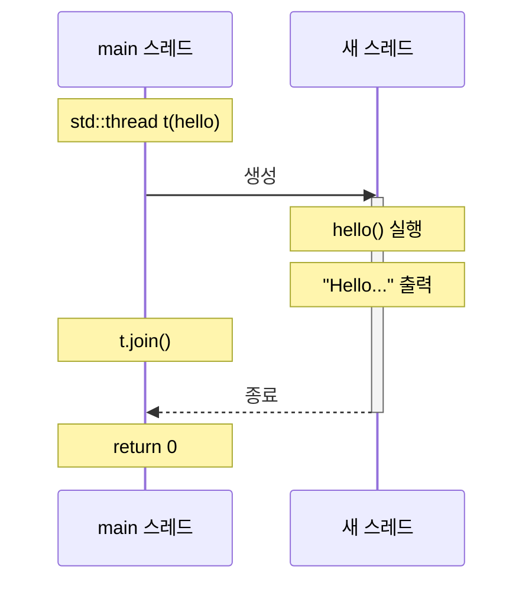

동시성(concurrency)은 왜 필요한가? 단일 스레드로 충분하지 않은가? 이 장에서는 동시성의 본질을 짚고, C++에서 첫 번째 스레드를 띄워 본다.

## 1.1 동시성이란 무엇인가

### 동시성 vs 병렬성

두 개념은 자주 혼용되지만 다르다.

| 개념 | 정의 | 핵심 |
|------|------|------|
| **동시성 (Concurrency)** | 여러 작업이 **논리적으로** 동시에 진행 | 구조의 문제 |
| **병렬성 (Parallelism)** | 여러 작업이 **물리적으로** 동시에 실행 | 실행의 문제 |


**동시성은 병렬성 없이도 존재한다.** 싱글 코어 CPU에서도 OS 스케줄러가 작업을 빠르게 전환하면 동시에 실행되는 것처럼 보인다.

**병렬성은 동시성을 전제한다.** 물리적으로 동시에 실행하려면 먼저 작업이 독립적으로 분리되어 있어야 한다.

### 왜 구분이 중요한가

동시성은 **설계 패턴**이고, 병렬성은 **실행 전략**이다.

```cpp
// 동시성: 구조적 분리 (싱글 코어에서도 의미 있음)
void server() {
    while (true) {
        auto conn = accept();          // 연결 대기
        std::thread([conn] {           // 각 연결을 독립 처리
            handle(conn);
        }).detach();
    }
}

// 병렬성: 성능 최적화 (멀티 코어 필수)
std::vector<int> data(1'000'000);
std::for_each(std::execution::par,     // 병렬 실행
              data.begin(), data.end(),
              [](int& x) { x *= 2; });
```

## 1.2 왜 동시성을 쓰는가

### 이유 1: 관심사 분리 (Separation of Concerns)

복잡한 시스템을 독립적인 작업 단위로 나눈다.


관심사 분리의 핵심은 **응답성(responsiveness)**이다. GUI 애플리케이션에서 파일 다운로드 중에도 UI가 반응하는 것이 대표적인 예다.

### 이유 2: 성능 (Performance)

무어의 법칙이 끝났다. 클럭 속도는 정체되고 코어 수가 늘어난다.

```
CPU 진화 (대략적):
2000: 1 GHz, 1 core    → 단일 스레드 최적화
2005: 3 GHz, 2 cores   → 병렬화 시작
2010: 3 GHz, 4 cores   → 병렬화 필수
2020: 3 GHz, 8+ cores  → 병렬화 기본
2025: 5 GHz, 24+ cores (P+E core 혼합), 서버는 96+ cores 일반
```

**싱글 스레드 성능은 한계에 도달했다.** 성능을 높이려면 코어를 더 쓰는 수밖에 없다.

```cpp
// 싱글 스레드: 1억 개 요소 처리
auto start = std::chrono::high_resolution_clock::now();
for (auto& x : data) { x = heavy_computation(x); }
auto end = std::chrono::high_resolution_clock::now();
// 예: 10초

// 멀티 스레드 (8코어): 이론상 8배 빠름
std::for_each(std::execution::par, data.begin(), data.end(),
              [](auto& x) { x = heavy_computation(x); });
// 예: 1.5초 (오버헤드 포함)
```

### 언제 동시성을 피해야 하는가

동시성은 복잡성을 더한다. 항상 득이 되지 않는다.

| 상황 | 권장 |
|------|------|
| 작업이 충분히 빠르다 | 단일 스레드 유지 |
| I/O 바운드지만 비동기로 해결 가능 | `async/await` 또는 이벤트 루프 |
| 공유 상태가 많다 | 락 비용 > 병렬화 이득 |
| 코드 복잡도가 급격히 증가한다 | 단순함 우선 |

> "Make it work, make it right, make it fast — in that order."

## 1.3 C++ 동시성의 역사

### C++11 이전: 표준 없음

C++03까지 표준 스레딩이 없었다. 플랫폼별 API를 직접 사용했다.

```cpp
// POSIX (Linux, macOS)
#include <pthread.h>
pthread_t thread;
pthread_create(&thread, nullptr, thread_func, nullptr);
pthread_join(thread, nullptr);

// Windows
#include <windows.h>
HANDLE thread = CreateThread(nullptr, 0, thread_func, nullptr, 0, nullptr);
WaitForSingleObject(thread, INFINITE);
CloseHandle(thread);
```

문제점:
- **이식성 없음** — 플랫폼마다 다른 코드
- **타입 안전성 없음** — `void*`로 인자 전달
- **RAII 없음** — 수동 리소스 관리

### C++11: 표준 스레딩 도입

C++11은 `<thread>`, `<mutex>`, `<condition_variable>`, `<future>`, `<atomic>`을 표준화했다.

```cpp
#include <thread>
#include <iostream>

void hello() {
    std::cout << "Hello from thread!\n";
}

int main() {
    std::thread t(hello);  // 스레드 생성
    t.join();              // 완료 대기
}
```

핵심 변화:
- **이식성** — 모든 플랫폼에서 동일한 코드
- **타입 안전성** — 템플릿 기반 인터페이스
- **RAII** — `std::thread` 소멸자가 리소스 관리

### C++14 ~ C++26: 지속적 개선

| 표준 | 추가된 기능 |
|------|------------|
| C++14 | `std::shared_timed_mutex` |
| C++17 | `std::shared_mutex`, `std::scoped_lock`, 병렬 알고리즘 |
| C++20 | `std::jthread`, `std::stop_token`, `std::latch`, `std::barrier`, `std::counting_semaphore` |
| C++23 | `std::generator` (코루틴), `std::expected`, monadic 인터페이스 |
| C++26 | `std::hazard_pointer`, `std::rcu`, `std::execution` (sender/receiver) 등 진행 중 |

## 1.4 C11 스레드 (C 언어)

C++11과 함께 C11도 표준 스레드 라이브러리를 도입했다. `<threads.h>` 헤더를 통해 플랫폼 독립적인 스레딩을 사용할 수 있다.

### C11 기본 스레드

```c
#include <stdio.h>
#include <threads.h>

int hello(void* arg) {
    (void)arg;
    printf("Hello from C11 thread!\n");
    return 0;
}

int main(void) {
    thrd_t t;

    // 스레드 생성
    if (thrd_create(&t, hello, NULL) != thrd_success) {
        return 1;
    }

    // 스레드 완료 대기
    int result;
    thrd_join(t, &result);

    return 0;
}
```

컴파일:

```bash
# GCC (Linux)
gcc -std=c11 -pthread hello.c -o hello

# Clang
clang -std=c11 -pthread hello.c -o hello
```

### C11 vs C++11 비교

| 기능 | C11 | C++11 |
|------|-----|-------|
| 스레드 생성 | `thrd_create(&t, func, arg)` | `std::thread t(func, args...)` |
| 대기 | `thrd_join(t, &result)` | `t.join()` |
| 분리 | `thrd_detach(t)` | `t.detach()` |
| 뮤텍스 | `mtx_t`, `mtx_lock()` | `std::mutex`, `.lock()` |
| 조건 변수 | `cnd_t`, `cnd_wait()` | `std::condition_variable` |
| 원자 연산 | `<stdatomic.h>` | `<atomic>` |

### C11 인자 전달

```c
#include <stdio.h>
#include <threads.h>
#include <stdlib.h>

typedef struct {
    int id;
    const char* message;
} ThreadArgs;

int worker(void* arg) {
    ThreadArgs* args = (ThreadArgs*)arg;
    printf("Thread %d: %s\n", args->id, args->message);
    return args->id;
}

int main(void) {
    ThreadArgs args = {42, "Hello!"};
    thrd_t t;

    thrd_create(&t, worker, &args);

    int result;
    thrd_join(t, &result);
    printf("Thread returned: %d\n", result);

    return 0;
}
```

### C11 스레드 로컬 저장소

```c
#include <stdio.h>
#include <threads.h>

// 스레드 로컬 변수
thread_local int tls_value = 0;

int worker(void* arg) {
    int id = *(int*)arg;
    tls_value = id * 100;
    printf("Thread %d: tls_value = %d\n", id, tls_value);
    return 0;
}

int main(void) {
    thrd_t t1, t2;
    int id1 = 1, id2 = 2;

    thrd_create(&t1, worker, &id1);
    thrd_create(&t2, worker, &id2);

    thrd_join(t1, NULL);
    thrd_join(t2, NULL);

    printf("Main: tls_value = %d\n", tls_value);  // 0 (각 스레드 독립)
    return 0;
}
```

> **참고:** C11 `<threads.h>`는 일부 플랫폼에서 지원이 제한적이다. Linux glibc 2.28+, macOS는 미지원(POSIX pthread 사용). 이식성이 필요하면 C++11 또는 POSIX pthread를 권장한다.

## 1.5 첫 번째 스레드: Hello, Concurrent World!

### 가장 간단한 예제

```cpp
#include <iostream>
#include <thread>

void hello() {
    std::cout << "Hello, Concurrent World!\n";
}

int main() {
    std::thread t(hello);  // 1. 스레드 생성, hello() 실행 시작
    t.join();              // 2. 스레드 완료까지 대기
    return 0;              // 3. 프로그램 종료
}
```

컴파일 및 실행:

```bash
# GCC
g++ -std=c++17 -pthread hello.cpp -o hello

# Clang
clang++ -std=c++17 -pthread hello.cpp -o hello

# MSVC
cl /std:c++17 /EHsc hello.cpp
```

### 실행 흐름



### join vs detach

스레드를 생성하면 반드시 `join()` 또는 `detach()` 중 하나를 호출해야 한다.

```cpp
std::thread t(hello);

// 선택 1: join — 완료까지 대기
t.join();   // 블로킹. t가 끝날 때까지 여기서 멈춤.

// 선택 2: detach — 분리
t.detach(); // 논블로킹. t는 백그라운드에서 계속 실행.
            // main이 먼저 끝나면 t도 강제 종료될 수 있음!
```

**`std::thread` 소멸자는 joinable 상태에서 호출되면 `std::terminate()`를 호출한다.** 이것이 C++의 명시적 설계다 — 프로그래머가 스레드의 수명을 결정하도록 강제한다.

```cpp
void dangerous() {
    std::thread t(hello);
    // join()도 detach()도 안 함
}   // 💥 std::terminate() 호출!

void safe() {
    std::thread t(hello);
    t.join();  // 또는 t.detach()
}   // ✓ 정상 종료
```

### 람다로 스레드 시작

함수 포인터 대신 람다를 쓰면 더 간결하다.

```cpp
#include <iostream>
#include <thread>

int main() {
    std::thread t([] {
        std::cout << "Hello from lambda!\n";
    });
    t.join();
}
```

캡처를 활용하면 데이터도 전달할 수 있다.

```cpp
int value = 42;
std::thread t([value] {              // 값 캡처
    std::cout << "Value: " << value << "\n";
});
t.join();

std::thread t2([&value] {            // 참조 캡처 (주의!)
    value = 100;                     // 원본 수정
});
t2.join();
// value == 100
```

> **주의:** 참조 캡처 시 스레드가 실행되는 동안 원본이 살아 있어야 한다. 지역 변수를 참조 캡처하고 `detach()`하면 댕글링 참조가 된다.

## 1.6 스레드 인자 전달

### 기본 인자 전달

`std::thread` 생성자는 가변 인자를 받는다.

```cpp
void greet(const std::string& name, int times) {
    for (int i = 0; i < times; ++i) {
        std::cout << "Hello, " << name << "!\n";
    }
}

int main() {
    std::thread t(greet, "World", 3);  // greet("World", 3) 호출
    t.join();
}
```

### 참조 전달의 함정

기본적으로 인자는 **복사**된다. 참조로 전달하려면 `std::ref`를 써야 한다.

```cpp
void increment(int& x) {
    ++x;
}

int main() {
    int value = 0;

    // std::thread t(increment, value);  // ❌ 복사됨, 원본 불변
    std::thread t(increment, std::ref(value));  // ✓ 참조 전달
    t.join();

    std::cout << value << "\n";  // 1
}
```

왜 이런 설계인가? **안전성**이다. 암묵적 참조 전달은 댕글링 참조의 원인이 된다. 명시적으로 `std::ref`를 쓰면 "이 참조가 유효함을 내가 보장한다"는 의도가 드러난다.

### move 전달

이동 전용 타입(`std::unique_ptr` 등)은 `std::move`로 전달한다.

```cpp
void process(std::unique_ptr<int> ptr) {
    std::cout << *ptr << "\n";
}

int main() {
    auto ptr = std::make_unique<int>(42);
    std::thread t(process, std::move(ptr));  // 소유권 이전
    t.join();
    // ptr은 이제 nullptr
}
```

## 1.7 예외 안전성

### 문제: join 전에 예외 발생

```cpp
void risky() {
    std::thread t(some_work);

    do_something_that_might_throw();  // 💥 예외 발생!

    t.join();  // 여기 도달 못함 → std::terminate()
}
```

### 해결: RAII thread guard

```cpp
class thread_guard {
    std::thread& t_;
public:
    explicit thread_guard(std::thread& t) : t_(t) {}
    ~thread_guard() {
        if (t_.joinable()) {
            t_.join();
        }
    }
    thread_guard(const thread_guard&) = delete;
    thread_guard& operator=(const thread_guard&) = delete;
};

void safe() {
    std::thread t(some_work);
    thread_guard g(t);              // RAII

    do_something_that_might_throw();  // 예외 발생해도
    // g 소멸자에서 t.join() 호출 → 안전
}
```

### C++20 해결: std::jthread

C++20의 `std::jthread`는 소멸자에서 자동으로 join한다.

```cpp
#include <thread>

void modern() {
    std::jthread t(some_work);  // j = joining

    do_something_that_might_throw();
    // 예외 발생해도 t 소멸자에서 자동 join
}
```

`std::jthread`는 또한 `std::stop_token`을 통한 협력적 취소를 지원한다. 이는 9장에서 다룬다.

## 1.8 스레드 식별

### std::thread::id

각 스레드는 고유한 ID를 갖는다.

```cpp
#include <iostream>
#include <thread>

int main() {
    std::cout << "Main thread ID: "
              << std::this_thread::get_id() << "\n";

    std::thread t([] {
        std::cout << "Worker thread ID: "
                  << std::this_thread::get_id() << "\n";
    });

    std::cout << "t's ID from main: " << t.get_id() << "\n";
    t.join();
}
```

출력 예:

```
Main thread ID: 140735987623744
t's ID from main: 140735987619648
Worker thread ID: 140735987619648
```

### hardware_concurrency

시스템이 지원하는 동시 스레드 수를 알려준다.

```cpp
unsigned int n = std::thread::hardware_concurrency();
std::cout << "Hardware threads: " << n << "\n";
// 예: 8 (4코어 하이퍼스레딩)
```

이 값은 **힌트**다. 0을 반환할 수도 있다. 스레드 풀 크기 결정 시 참고하되, 맹신하지 않는다.

## 정리

- **동시성**은 구조, **병렬성**은 실행이다
- 동시성의 두 이유: **관심사 분리**(응답성)와 **성능**(멀티코어 활용)
- C++11 이전에는 표준 스레딩이 없었다. POSIX/Windows API를 직접 사용했다
- `std::thread`로 스레드를 생성하고, 반드시 `join()` 또는 `detach()`를 호출해야 한다
- 인자는 기본적으로 **복사**된다. 참조 전달은 `std::ref`, 이동은 `std::move`
- 예외 안전성을 위해 RAII 패턴 또는 C++20 `std::jthread`를 사용한다

## 한국 개발자의 함정

```
1. *thread 만들고 join 잊음*
   - std::thread 소멸자 → std::terminate (즉시 abort)
   - 반드시 join() 또는 detach() 명시
   - C++20 std::jthread는 자동 join

2. *detach()가 안전한 선택*
   - detach 후 메인이 끝나면 스레드 강제 종료
   - 댕글링 참조 위험 (스택 변수 캡처)
   - join이 거의 항상 더 안전

3. *참조 전달이 자동*이라는 오해
   - std::thread는 인자를 *복사*
   - 참조 필요 시 std::ref(x) 명시
   - 안전성을 위한 명시적 설계

4. *hardware_concurrency() = 정확한 코어 수*
   - 단지 *힌트* (0 반환 가능)
   - 하이퍼스레딩 포함 (논리 코어)
   - 컨테이너 / VM에선 호스트 값일 수도

5. *동시성 = 성능 향상*
   - 작업이 충분히 짧으면 오버헤드 > 이득
   - I/O 바운드는 async/await가 더 적합
   - 측정 없이 도입 금지
```

## 실무 적용

```
이론 → 실무:
- std::thread          → POSIX pthread, Win32 CreateThread
- std::jthread (C++20) → 자동 join + stop_token
- std::ref             → std::reference_wrapper
- thread_local         → __thread (gcc), TLS

언어별:
- C++: std::thread, std::jthread, std::async
- Java: Thread, Runnable, ExecutorService
- Rust: std::thread::spawn (JoinHandle 반환)
- Go: goroutine + channel
- Python: threading.Thread (GIL 한계 있음)

설계 원칙:
- 짧은 작업 → std::async / thread pool
- 긴 작업 / 백그라운드 → std::jthread
- 매우 짧은 동시 / 비동기 I/O → coroutine (C++20)
```

## 자기 점검

```
□ 동시성과 병렬성의 차이?
□ join과 detach 선택 기준?
□ std::ref가 필요한 이유?
□ std::jthread의 자동 join 메커니즘?
□ hardware_concurrency()를 *신뢰*하면 안 되는 이유?
□ 동시성을 *피해야* 하는 시나리오?
```

## 다음 장 예고

다음 장에서는 스레드의 생애 주기를 더 깊이 다룬다. `join`과 `detach`의 선택 기준, 스레드에 인자를 전달하는 다양한 방법, 그리고 C++20의 `std::jthread`와 `std::stop_token`을 살펴본다.

## 관련 항목

- [Ch 2: Managing Threads](/blog/parallel/cpp-concurrency-in-action/chapter02-managing-threads)
- [AMP Ch 1: Introduction](/blog/parallel/parallel-principles/ch01-introduction) — 동시성 이론적 토대
