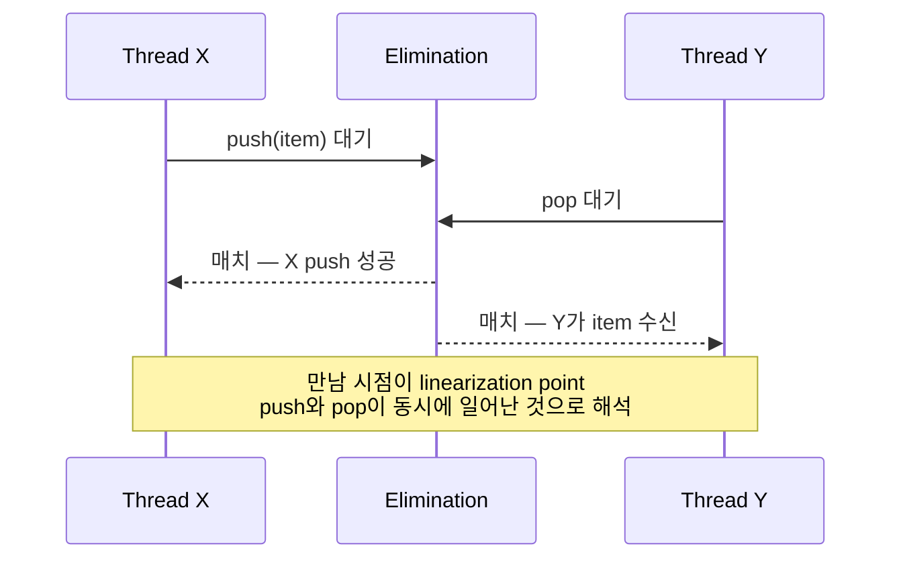

> **The Art of Multiprocessor Programming** Chapter 11 요약
>
> 이 시리즈는 C++20/23과 C11을 사용하여 최신 문법으로 재구성했다.

## 11.1 Lock-Free Stack — Treiber Stack

가장 단순한 lock-free 자료구조.

### C++20/23 구현

```cpp
#include <atomic>
#include <memory>
#include <optional>

template<typename T>
class TreiberStack {
private:
    struct Node {
        T data;
        Node* next;
        explicit Node(T value) : data(std::move(value)), next(nullptr) {}
    };

    std::atomic<Node*> top{nullptr};

public:
    void push(T item) {
        Node* newNode = new Node(std::move(item));
        newNode->next = top.load(std::memory_order_relaxed);

        // CAS: 성공할 때까지 재시도
        while (!top.compare_exchange_weak(
            newNode->next, newNode,
            std::memory_order_release,
            std::memory_order_relaxed)) {
            // newNode->next가 자동으로 현재 top으로 갱신됨
        }
    }

    std::optional<T> pop() {
        Node* oldTop = top.load(std::memory_order_acquire);

        while (oldTop != nullptr) {
            Node* newTop = oldTop->next;

            if (top.compare_exchange_weak(
                oldTop, newTop,
                std::memory_order_release,
                std::memory_order_acquire)) {
                T result = std::move(oldTop->data);
                delete oldTop;  // 주의: ABA 문제 가능
                return result;
            }
            // oldTop이 자동으로 현재 top으로 갱신됨
        }
        return std::nullopt;
    }
};
```

### C11 구현

```c
#include <stdatomic.h>
#include <stdlib.h>
#include <stdbool.h>

typedef struct Node {
    int data;
    struct Node* next;
} Node;

typedef struct {
    _Atomic(Node*) top;
} TreiberStack;

void treiber_stack_init(TreiberStack* stack) {
    atomic_store(&stack->top, NULL);
}

void treiber_stack_push(TreiberStack* stack, int item) {
    Node* newNode = malloc(sizeof(Node));
    newNode->data = item;
    newNode->next = atomic_load_explicit(&stack->top, memory_order_relaxed);

    // CAS: 성공할 때까지 재시도
    while (!atomic_compare_exchange_weak_explicit(
        &stack->top,
        &newNode->next,
        newNode,
        memory_order_release,
        memory_order_relaxed)) {
        // newNode->next가 자동으로 현재 top으로 갱신됨
    }
}

bool treiber_stack_pop(TreiberStack* stack, int* out) {
    Node* oldTop = atomic_load_explicit(&stack->top, memory_order_acquire);

    while (oldTop != NULL) {
        Node* newTop = oldTop->next;

        if (atomic_compare_exchange_weak_explicit(
            &stack->top,
            &oldTop,
            newTop,
            memory_order_release,
            memory_order_acquire)) {
            *out = oldTop->data;
            free(oldTop);  // 주의: ABA 문제 가능
            return true;
        }
        // oldTop이 자동으로 현재 top으로 갱신됨
    }
    return false;
}
```

**핵심** — top 포인터에 대한 CAS 한 번. 매우 단순하고 빠르다.

## 11.2 Treiber Stack의 한계

성능 측정을 해 보면 — **경합이 심하면 매우 느리다**.

이유는 단순하다. 모든 스레드가 같은 변수(top)에 CAS를 시도한다. **Cache line contention**이 매우 크다.

```
8 코어, 모두 push 시도:
- 매 사이클 7 코어가 CAS 실패
- top cache line이 코어 사이를 핑퐁
- 처리량 거의 0에 수렴
```

이게 단순 lock-free의 한계다. **모두가 같은 위치에서 경쟁**하면 락보다도 못한 성능.

## 11.3 통찰 — Push와 Pop이 만나면?

Herlihy의 우아한 통찰.

> **Push와 Pop이 동시에 일어나면 — 그 두 작업은 서로 상쇄된다.**

```
스택: [A, B, C]
스레드 X: push(D)
스레드 Y: pop() → 무엇을 받을까?
```

답은 두 가지 가능.

1. push가 먼저 — Y는 D를 받음
2. pop이 먼저 — Y는 C를 받음, 그 후 push로 D 추가

**둘 다 정당하다**. Linearizability는 어느 순서든 허용.

그렇다면 — **스택 자체를 안 거치고** push/pop이 서로 합의할 수 있을까? push가 D를 쥐고 있고 pop이 기다리고 있다면, 둘이 만나서 push가 D를 직접 pop에게 넘기면 된다. 스택은 그대로.

이게 **Elimination Backoff Stack**의 아이디어.

## 11.4 Elimination Backoff Stack


### C++20/23 구현

```cpp
#include <atomic>
#include <memory>
#include <optional>
#include <random>
#include <thread>
#include <chrono>

template<typename T>
class EliminationStack {
private:
    static constexpr size_t ELIMINATION_ARRAY_SIZE = 16;
    static constexpr auto TIMEOUT = std::chrono::microseconds(100);

    // Exchanger: 두 스레드가 값을 교환하는 슬롯
    struct Exchanger {
        enum class State { EMPTY, WAITING, BUSY };

        std::atomic<State> state{State::EMPTY};
        std::atomic<T*> item{nullptr};

        // exchange 시도: 상대방과 값을 교환
        std::optional<T> exchange(T* myItem, std::chrono::microseconds timeout) {
            auto deadline = std::chrono::steady_clock::now() + timeout;

            while (std::chrono::steady_clock::now() < deadline) {
                State expected = State::EMPTY;

                // 슬롯이 비어있으면 내가 먼저 대기
                if (state.compare_exchange_strong(expected, State::WAITING,
                    std::memory_order_acq_rel)) {
                    item.store(myItem, std::memory_order_release);

                    // 상대방 기다림
                    while (std::chrono::steady_clock::now() < deadline) {
                        if (state.load(std::memory_order_acquire) == State::BUSY) {
                            T* other = item.load(std::memory_order_acquire);
                            state.store(State::EMPTY, std::memory_order_release);
                            if (other) return *other;
                            return std::nullopt;
                        }
                    }
                    // 타임아웃 — 원복
                    expected = State::WAITING;
                    if (state.compare_exchange_strong(expected, State::EMPTY,
                        std::memory_order_acq_rel)) {
                        return std::nullopt;
                    }
                    // 그 사이 누가 와서 BUSY로 바꿈
                    T* other = item.load(std::memory_order_acquire);
                    state.store(State::EMPTY, std::memory_order_release);
                    if (other) return *other;
                    return std::nullopt;
                }

                // 누군가 대기 중이면 교환 시도
                if (expected == State::WAITING) {
                    if (state.compare_exchange_strong(expected, State::BUSY,
                        std::memory_order_acq_rel)) {
                        T* other = item.exchange(myItem, std::memory_order_acq_rel);
                        if (other) return *other;
                        return std::nullopt;
                    }
                }
            }
            return std::nullopt;
        }
    };

    TreiberStack<T> centralStack;
    std::array<Exchanger, ELIMINATION_ARRAY_SIZE> eliminationArray;

    size_t randomSlot() {
        thread_local std::mt19937 gen(std::random_device{}());
        thread_local std::uniform_int_distribution<size_t> dist(0, ELIMINATION_ARRAY_SIZE - 1);
        return dist(gen);
    }

public:
    void push(T item) {
        T* itemPtr = new T(std::move(item));

        while (true) {
            // 먼저 central stack 시도
            centralStack.push(*itemPtr);
            delete itemPtr;
            return;

            // 실패 시 elimination 시도 (간략화)
            size_t slot = randomSlot();
            auto result = eliminationArray[slot].exchange(itemPtr, TIMEOUT);
            if (result.has_value()) {
                // pop과 만남 — 성공
                delete itemPtr;
                return;
            }
        }
    }

    std::optional<T> pop() {
        while (true) {
            auto item = centralStack.pop();
            if (item.has_value()) {
                return item;
            }

            // elimination 시도
            size_t slot = randomSlot();
            auto result = eliminationArray[slot].exchange(nullptr, TIMEOUT);
            if (result.has_value()) {
                return result;
            }
        }
    }
};
```

### C11 구현 (간략화)

```c
#include <stdatomic.h>
#include <stdlib.h>
#include <stdbool.h>
#include <time.h>

#define ELIMINATION_ARRAY_SIZE 16
#define TIMEOUT_NS 100000  // 100 microseconds

typedef enum {
    EXCHANGER_EMPTY,
    EXCHANGER_WAITING,
    EXCHANGER_BUSY
} ExchangerState;

typedef struct {
    _Atomic(ExchangerState) state;
    _Atomic(int*) item;
} Exchanger;

typedef struct {
    TreiberStack central_stack;
    Exchanger elimination_array[ELIMINATION_ARRAY_SIZE];
} EliminationStack;

void elimination_stack_init(EliminationStack* stack) {
    treiber_stack_init(&stack->central_stack);
    for (int i = 0; i < ELIMINATION_ARRAY_SIZE; i++) {
        atomic_store(&stack->elimination_array[i].state, EXCHANGER_EMPTY);
        atomic_store(&stack->elimination_array[i].item, NULL);
    }
}

static size_t random_slot(void) {
    return (size_t)rand() % ELIMINATION_ARRAY_SIZE;
}

// exchange 구현 (간략화)
static bool exchanger_exchange(Exchanger* ex, int* my_item, int* out_item) {
    ExchangerState expected = EXCHANGER_EMPTY;

    if (atomic_compare_exchange_strong(&ex->state, &expected, EXCHANGER_WAITING)) {
        atomic_store(&ex->item, my_item);

        // 잠시 대기
        struct timespec ts = {0, TIMEOUT_NS};
        nanosleep(&ts, NULL);

        if (atomic_load(&ex->state) == EXCHANGER_BUSY) {
            int* other = atomic_load(&ex->item);
            atomic_store(&ex->state, EXCHANGER_EMPTY);
            if (other && out_item) *out_item = *other;
            return other != NULL;
        }

        expected = EXCHANGER_WAITING;
        atomic_compare_exchange_strong(&ex->state, &expected, EXCHANGER_EMPTY);
        return false;
    }

    if (expected == EXCHANGER_WAITING) {
        if (atomic_compare_exchange_strong(&ex->state, &expected, EXCHANGER_BUSY)) {
            int* other = atomic_exchange(&ex->item, my_item);
            if (other && out_item) *out_item = *other;
            return other != NULL;
        }
    }

    return false;
}

void elimination_stack_push(EliminationStack* stack, int item) {
    // 단순화: central stack에 직접 push
    treiber_stack_push(&stack->central_stack, item);
}

bool elimination_stack_pop(EliminationStack* stack, int* out) {
    // 먼저 central stack 시도
    if (treiber_stack_pop(&stack->central_stack, out)) {
        return true;
    }

    // elimination 시도
    size_t slot = random_slot();
    int result;
    if (exchanger_exchange(&stack->elimination_array[slot], NULL, &result)) {
        *out = result;
        return true;
    }

    return false;
}
```

**메커니즘**:

1. 먼저 central stack에 시도
2. 실패 시 — **elimination array**의 랜덤 슬롯에서 짝을 기다림
3. push와 pop이 같은 슬롯에서 만나면 — 서로 직접 교환, 스택은 그대로

## 11.5 왜 이게 빠른가

**경합이 적을 때** — central stack의 CAS가 보통 성공. Treiber stack과 거의 같음.

**경합이 심할 때** — central stack CAS 실패가 많지만, 그만큼 push/pop 짝이 많이 있다. Elimination array에서 만날 확률이 높음.

```
경합 ↑ → CAS 실패 ↑ → 그러나 elimination 만남 ↑
        결과: 처리량 ↑
```

직관적으로 모순이지만 — **경합이 심할수록 elimination이 더 잘 작동**한다.

## 11.6 Elimination Array의 설계

각 슬롯은 **Exchanger** — 두 스레드가 만나서 값을 교환하는 동기화 객체.

### C++20/23 Exchanger

```cpp
template<typename T>
class Exchanger {
private:
    enum class State : int { EMPTY = 0, WAITING = 1, BUSY = 2 };

    std::atomic<State> state{State::EMPTY};
    std::atomic<T*> item{nullptr};

public:
    std::optional<T> exchange(T* myItem, std::chrono::microseconds timeout) {
        using namespace std::chrono;
        auto deadline = steady_clock::now() + timeout;

        while (steady_clock::now() < deadline) {
            State expected = State::EMPTY;

            // 슬롯 비어있음 — 내가 먼저 대기
            if (state.compare_exchange_strong(expected, State::WAITING)) {
                item.store(myItem, std::memory_order_release);

                // 상대방 대기
                while (steady_clock::now() < deadline) {
                    if (state.load(std::memory_order_acquire) == State::BUSY) {
                        T* other = item.load(std::memory_order_acquire);
                        state.store(State::EMPTY, std::memory_order_release);
                        return other ? std::optional<T>(*other) : std::nullopt;
                    }
                }

                // 타임아웃
                expected = State::WAITING;
                if (!state.compare_exchange_strong(expected, State::EMPTY)) {
                    T* other = item.load(std::memory_order_acquire);
                    state.store(State::EMPTY, std::memory_order_release);
                    return other ? std::optional<T>(*other) : std::nullopt;
                }
                return std::nullopt;
            }

            // 누군가 대기 중 — 교환 시도
            if (expected == State::WAITING) {
                if (state.compare_exchange_strong(expected, State::BUSY)) {
                    T* other = item.exchange(myItem, std::memory_order_acq_rel);
                    return other ? std::optional<T>(*other) : std::nullopt;
                }
            }
        }
        return std::nullopt;
    }
};
```

세 상태:

- **EMPTY** — 아무도 없음
- **WAITING** — 한 명이 기다리는 중
- **BUSY** — 두 명이 만나서 교환 중

**랜덤 슬롯 선택** — 모든 스레드가 같은 슬롯에 모이면 경합. 랜덤이라 분산됨.

**Adaptive sizing** — 경합 정도에 따라 array 크기 조정. 경합 많으면 array 크게, 적으면 작게.

## 11.7 Linearizability 보장

흥미로운 질문 — push와 pop이 elimination으로 만나면, 스택의 linearizability가 유지되는가?

**답**: 그렇다.



X와 Y가 elimination으로 만나는 시점이 linearization point. 그 시점에 push와 pop이 동시에 일어났다고 해석. Linearizability 정의 만족.

## 11.8 다른 elimination 응용

이 아이디어는 stack에만 국한되지 않는다.

- **Counter** — increment와 decrement
- **Set** — add와 remove
- **Map** — 어떤 키 / 어떤 값 등

서로 상쇄되는 작업 쌍이 있으면 elimination 적용 가능.

다만 — **서로 상쇄 가능한지**가 자료구조의 명세에 달려 있다. Stack/Queue/Counter에서는 쉽다. 정렬된 구조에서는 어렵다.

## 11.9 실용성

Elimination Backoff Stack은 이론적으로 우아하다. 실용성은?

- **고경합 시 매우 빠름** — Treiber보다 수 배 빠를 수 있음
- **저경합 시 비슷** — Treiber와 거의 같음
- **복잡도** — 구현이 매우 복잡

실전에서는 라이브러리(java.util.concurrent.ConcurrentLinkedQueue 등)가 이런 최적화를 내장한다. 직접 짜는 건 어렵다.

## 정리

- **Treiber Stack** — 가장 단순한 lock-free 자료구조
- 경합이 심하면 Cache line contention으로 매우 느림
- **Elimination 아이디어** — push와 pop이 서로 상쇄 가능
- **Elimination Backoff Stack** — central stack + exchanger array
- 경합이 심할수록 elimination이 잘 작동 — **반직관적**
- Stack 외에도 적용 가능 (Counter, Set 등 — 상쇄 가능한 작업이 있다면)

## 한국 개발자의 함정

```
1. *Treiber Stack = 빠른 lock-free*라는 오해
   - 단일 코어 / 저경합에선 빠름
   - 고경합에선 cache line contention으로 락보다 느림
   - 측정 없이 lock-free 선택 금지

2. *Elimination = 무조건 더 빠름*
   - push/pop 비율이 비슷할 때만 효과
   - 비대칭 워크로드(예: push만)에선 무의미
   - 오히려 오버헤드만 추가

3. *직접 구현*하려는 시도
   - Exchanger의 state machine이 미묘
   - Linearization point 증명이 어려움
   - 라이브러리(java.util.concurrent.Exchanger) 사용

4. *Linearizability를 직관에 맡김*
   - elimination이 linearizable인 이유는 *증명* 필요
   - 비슷한 최적화에서 자주 깨짐
```

## 실무 적용

```
이론 → 실무:
- Treiber Stack          → boost::lockfree::stack
- Elimination 일반        → java.util.concurrent.Exchanger
- Stack with elimination  → JSR-166 EliminationStack (참고용)
- Lock-free deque         → boost::lockfree::stack

언어별:
- C++: boost::lockfree::stack, folly::AtomicLinkedList, std::atomic 직접 구현
- C: stdatomic.h + 직접 구현 (hazard pointer 필요)
- Java: ConcurrentLinkedDeque, Exchanger
- Rust: crossbeam::queue::SegQueue (스택 유사)
- Go: 직접 구현 드묾 — channel로 대체

설계 원칙:
- Producer-consumer 패턴 → channel/queue, stack 아님
- 진짜 LIFO 필요 시만 stack
- 측정 후 elimination 적용 (저경합엔 불필요)
```

## 자기 점검

```
□ Treiber Stack에서 ABA는 어떻게 발생?
□ Cache line contention의 메커니즘?
□ Elimination이 linearizable인 이유?
□ Exchanger의 세 상태 (EMPTY/WAITING/BUSY)?
□ 경합과 elimination의 *반직관적* 관계?
□ Elimination을 적용할 수 있는 자료구조 조건?
```

## 다음 장 예고

다음 장은 **Counting, Sorting, Distributed Coordination** — 분산 카운터와 정렬 네트워크.

## 관련 항목

- [Ch 10: Queue와 ABA](/blog/parallel/parallel-principles/ch10-concurrent-queues-and-the-aba-problem)
- [Ch 9: Linked Lists](/blog/parallel/parallel-principles/ch09-linked-lists-the-role-of-locking)
- [Ch 12: Counting & Sorting](/blog/parallel/parallel-principles/ch12-counting-sorting-and-distributed-coordination)
- [C++ Concurrency in Action Ch 7: Lock-free](/blog/parallel/cpp-concurrency-in-action/chapter07-designing-lock-free-concurrent-data-structures)
