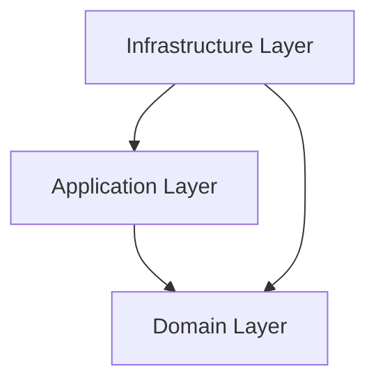

## 왜 이 가이드라인이 중요한가?

좋은 디자인은 — **코드에 일부 드러난다**(클래스 이름, 의존성, 인터페이스). 그러나 — **왜 이렇게 디자인했는지**(rationale), **무엇을 트레이드오프 했는지**, **대안은 무엇이었는지** 는 코드에 안 나옴.

6개월 후 다른 개발자(또는 미래의 자신)가:

```cpp
class OrderService {
    IOrderRepository& repo_;
    ILogger&         log_;
    IEventBus&       events_;
    // ...
};
```

이 코드 보고 — "**왜 EventBus가 필요한가? 왜 직접 호출 안 하나?**" 모름. 잘못 이해해서 — 디자인을 깨는 변경.

**아키텍처 문서**가 답. 코드의 **의도와 결정**을 — 별도 문서로. Iglberger는 — **간결한 문서**를 강조 (UML 100장이 아닌, ADR 한 페이지).

## 핵심 내용

- 코드는 — **무엇**(what)을 보여줌. 문서가 — **왜**(why)를 보존
- **간결한 문서** — 유지 가능, 진화 가능
- **Architecture Decision Records** (ADR) — 결정의 기록
- **C4 모델** — 4단계 다이어그램 (Context, Container, Component, Code)
- 코드와 동기화 — 문서가 진실과 다르면 무가치

## 비교 — 문서 없음 vs 있음

### Bad: 문서 없음

```cpp
class OrderService {
    IOrderRepository& repo_;
    IEventBus&        events_;
public:
    void place(Order o) {
        repo_.persist(o);
        events_.publish(OrderPlacedEvent{o.id()});
    }
};
```

6개월 후 새 개발자:
- 왜 EventBus 필요? 직접 다른 서비스 호출이 안 됐나?
- 왜 비동기인가? 동기로 처리 안 했나?
- repo와 events 모두 — repository 안에 통합하면 안 됐나?

**답이 없으니 — 잘못 변경**.

### Good: ADR로 결정 기록

```markdown
# ADR-005: Use EventBus for Cross-Service Notification

## Status
Accepted (2025-08)

## Context
주문이 처리되면 — Email, Inventory, Analytics 서비스가 알아야 한다.
직접 호출 (synchronous, point-to-point)도 옵션이지만, 다음 문제:
- OrderService가 — 모든 downstream 서비스를 알아야 (강결합)
- 한 서비스 실패가 — Order 실패로 (불가용성)
- 새 알림 대상 추가 → OrderService 수정

## Decision
EventBus를 — pub/sub 추상화로. OrderService는 — event만 발행.
downstream 서비스가 — 자기 책임으로 subscribe.

## Consequences
+ 새 알림 대상 추가 — OrderService 무수정
+ downstream 실패가 — OrderService에 영향 X
+ 비동기 — eventual consistency
- 추가 인프라 (EventBus 구현, 메시지 큐)
- 디버깅 복잡도 ↑ (분산 trace 필요)

## Alternatives Considered
1. Direct synchronous calls — 강결합 (rejected)
2. Message queue (Kafka) — 단일 EventBus보다 무거움 (현재 규모엔 과함)
3. Observer pattern in-process — 다중 서비스 환경 부적합

## References
- 가이드라인 25 (Observer)
- Internal Wiki: System Architecture Overview
```

이제 새 개발자:
- 의도 명확
- 트레이드오프 인지
- 변경 시 — 결정 깨지 않게

## Architecture Decision Records (ADR)

ADR — 가장 가벼우면서 효과적인 문서.

### ADR 표준 구조

```markdown
# ADR-NNN: <결정 제목>

## Status
Draft / Proposed / Accepted / Deprecated / Superseded by ADR-MMM

## Context
배경, 문제, 제약조건

## Decision
무엇을 선택했나 (한 문단)

## Consequences
+ 긍정적 결과
- 부정적 결과

## Alternatives Considered
다른 옵션과 — 왜 rejected
```

### ADR 위치

```
project/
└── docs/
    └── architecture/
        ├── 001-use-postgres-for-primary-store.md
        ├── 002-event-driven-for-notifications.md
        ├── 003-graphql-for-api-gateway.md
        ├── ...
```

git에 — 코드와 함께 버전 관리. PR로 ADR 추가/변경.

### ADR 도구

- **adr-tools** — CLI로 ADR 생성/관리
- **MADR** (Markdown Architecture Decision Records) — 표준 템플릿
- **plantuml + ADR** — 다이어그램과 결합

## C4 Model — 4단계 다이어그램

Simon Brown의 — 아키텍처 시각화 모델. 4단계 추상화:

### Level 1: System Context

```
            ┌──────────────┐
   User ──→ │ Order System │ ──→ Payment Provider
            │              │ ──→ Email Service
            └──────────────┘
```

시스템 자체 — 외부 actor / 시스템과의 관계만.

### Level 2: Container

```
┌─ Order System ──────────────────────────┐
│  ┌────────┐    ┌────────┐    ┌────────┐ │
│  │ Web    │ ──→│ API    │ ──→│ DB     │ │
│  │ App    │    │ Server │    │        │ │
│  └────────┘    └────────┘    └────────┘ │
└─────────────────────────────────────────┘
```

시스템 안의 — 큰 단위 (앱, 서비스, DB, 메시지 큐).

### Level 3: Component

```
┌─ API Server ──────────────────────┐
│  ┌──────────┐  ┌──────────┐       │
│  │ Order    │→ │ Order    │       │
│  │ Controller│  │ Service  │       │
│  └──────────┘  └────┬─────┘       │
│                     ↓             │
│                ┌──────────┐       │
│                │ Order    │       │
│                │ Repository│       │
│                └──────────┘       │
└───────────────────────────────────┘
```

컨테이너 안의 — 컴포넌트 (클래스 / 모듈).

### Level 4: Code

```
class diagram (UML)
```

코드 수준 — 실제 클래스. 종종 생략 (코드 자체로 충분).

## 문서의 4가지 청중

| 청중 | 필요한 정보 |
| --- | --- |
| **새 개발자** | 시스템 개요, 어디서 시작? |
| **기존 개발자** | 결정의 이유, 트레이드오프 |
| **stakeholder / PM** | 무엇이 가능 / 불가능 |
| **아키텍트** | 큰 그림, 의존성 |

문서가 — 모든 청중에 답할 필요 X. 각자에 맞는 문서 분리.

## 무엇을 문서화할까

### ✅ 문서화 가치 있음

- **결정의 이유** (왜 이 패턴? 왜 이 라이브러리?)
- **트레이드오프** (선택의 비용)
- **암묵 계약** (코드에 안 드러나는 약속)
- **의존성 방향** (이건 저것에 의존)
- **데이터 흐름** (시스템 간 데이터 이동)
- **non-functional requirements** (성능, 보안, 가용성)

### ❌ 문서화 가치 없음 (또는 적음)

- **메서드 시그니처** (코드 자체에 있음, IDE가 보여줌)
- **자명한 동작** ("이 함수는 +를 계산합니다")
- **구현 디테일** (자주 변하므로 문서가 stale)

## 함정 — 문서가 코드와 다름

```markdown
# OrderService 사용법
OrderService::processOrder()를 호출하세요.
```

```cpp
class OrderService {
    void place_order(Order&);     // ⚠️ 메서드 이름이 다름!
};
```

코드 변경 → 문서 미반영 → **stale 문서**. 차라리 문서 없는 것보다 못함.

**규칙**:
- 코드에서 추출 가능한 건 — 코드에 (Doxygen 등)
- 자주 변하는 건 — 문서화 X
- **결정의 이유**처럼 — 한 번 작성하면 잘 안 변하는 것만

## 코드 자체가 문서 — Self-documenting

```cpp
// Bad: 주석에 의존
// 사용자가 18세 이상인지 검사
if (user.age >= 18) { /* ... */ }

// Good: 의미 있는 이름
if (user.is_adult()) { /* ... */ }

// Good: 명시적 상수
constexpr int LegalAdultAge = 18;
if (user.age() >= LegalAdultAge) { /* ... */ }
```

코드 — 도메인 어휘로. 자명한 코드는 — 주석 불필요.

## Doxygen — 코드 안 문서

```cpp
/// Persists an order to the repository.
/// 
/// @param order The order to persist. Must have a valid id.
/// @pre order.id() != 0
/// @post repo contains order
/// @throws std::runtime_error if persistence fails
///
/// @see OrderRepository
void persist(const Order& order);
```

Doxygen — public API 자동 문서. 코드와 같은 파일.

```bash
doxygen Doxyfile     # 자동으로 HTML 문서 생성
```

장점:
- 코드와 함께 — 동기화 쉬움
- 인터페이스 명세 + 의도
- IDE 통합 (호버에 표시)

단점:
- 구현 디테일은 — 여전히 stale 위험
- 너무 자세하면 — 코드 가독성 ↓

## README — 시작점

```markdown
# Project Name

## What
한 문단 — 시스템이 하는 일

## Why
한 문단 — 왜 존재하나

## How to Build
```bash
cmake -B build && cmake --build build
```

## How to Run
...

## Architecture
간단한 다이어그램 또는 ADR 폴더 링크

## Contributing
PR 절차

## License
```

새 개발자 — README 읽고 30분 안에 빌드/실행 가능해야.

## 다이어그램 — 도구

- **PlantUML** — 텍스트 기반 (git 친화)
- **Mermaid** — Markdown에 임베드
- **Draw.io / Lucidchart** — 그래픽 UI
- **Excalidraw** — 손으로 그린 느낌

**텍스트 기반** (PlantUML, Mermaid) — git diff 가능, code review 가능.



## 라이프타임 다이어그램

```
Client            Service           Database
  │                  │                  │
  │── place_order ──→│                  │
  │                  │── persist ──────→│
  │                  │←── ack ──────────│
  │                  │── publish event ─→ EventBus
  │←── confirmation ─│                  │
```

복잡한 흐름 — sequence diagram이 좋음.

## 의존성 다이어그램

```
domain (no deps)
  ↑
application
  ↑
infrastructure → external libraries
       ↑
   main / DI container
```

레이어드 아키텍처 — 의존 방향. 가이드라인 9의 시각화.

## 비-기능 요구사항 (NFR)

```markdown
## Performance
- API latency p99 < 100ms
- Throughput: 1000 RPS

## Availability
- 99.9% uptime
- Graceful degradation on dependency failure

## Security
- All data at rest encrypted
- TLS 1.3 for transport
- JWT auth, 1h expiry

## Scalability
- Horizontal scaling — stateless services
- DB read replicas
```

코드 자체엔 안 드러남. 문서로.

## 함정 — Big Design Up-Front

```
프로젝트 시작 시 — 100페이지 디자인 문서
   ↓
실제 코딩 시작 — 디자인이 현실과 안 맞음
   ↓
문서 무시 — stale
```

**Agile 원칙**: 문서는 — **필요한 만큼만**. 시스템 진화하면서 문서 진화.

- 작게 시작 — README + 핵심 ADR 몇 개
- 결정 마다 — ADR 추가
- 큰 변화 시 — 다이어그램 업데이트
- **stale은 — 즉시 삭제 또는 수정**

## 함정 — UML 의식

```
프로젝트 시작 → UML 클래스 다이어그램 50장
구현 시작 → UML과 어긋남
6개월 후 — UML 폴더 그대로, 코드는 다른 방향
```

UML은 — **소통 도구**일 때만 가치. 자세한 클래스 다이어그램 — 코드 자체 + IDE의 클래스 뷰가 더 정확. **시스템 수준 다이어그램** (Container, Component)만.

## ADR 예 — 실전

```markdown
# ADR-012: Adopt std::variant over Inheritance for Message Types

## Status
Accepted (2026-01-15)

## Context
Network protocol에서 — 여러 메시지 타입 처리 필요:
- HandshakeMsg, DataMsg, AckMsg, ErrorMsg, ...
- 메시지 수는 고정 (프로토콜로 정의)
- 새 연산은 자주 추가 (parse, serialize, log, validate, route)

옵션:
1. Class hierarchy: `class Message; class HandshakeMsg : public Message;`
2. `std::variant<HandshakeMsg, DataMsg, AckMsg, ErrorMsg>`

## Decision
`std::variant` 채택. 이유:
- 메시지 타입은 — 프로토콜로 고정 (closed set)
- 새 연산 추가 빈번 — variant + visit이 OCP 만족
- vtable 비용 회피 — 임베디드 환경
- value semantics — heap 할당 없음

## Consequences
+ 새 연산 추가 — 비-멤버 함수만, 기존 메시지 클래스 무수정
+ 컴파일러가 모든 케이스 검증 (누락 시 에러)
+ 성능 — vtable 없음, 임베디드 친화
- 새 메시지 타입 추가 — variant 정의 + 모든 visit 수정 (드물게 발생)
- 코드 부피 — 각 visit이 컴파일 타임 분기

## Alternatives Considered
- **Inheritance**: 새 연산마다 base 인터페이스 변경 → 모든 derived 수정. OCP 위반 빈번.
- **Type erasure (std::function)**: 런타임 비용, type 손실
- **Tagged union (C-style)**: type safety 부족

## References
- 가이드라인 5 (Design for Extension)
- 가이드라인 15 (Visitor design)
- Iglberger Ch 4
```

## 도구

문서 관리 도구:

- **Markdown + git** — 가장 단순, 권장
- **Confluence / Notion** — 협업 친화, 위키 스타일
- **MkDocs / Docusaurus** — 문서 사이트 생성
- **README + ADR + Doxygen** — 표준 조합

## 실무 가이드 — 문서 시작

새 프로젝트 시작 시 최소 세트:

1. **README.md** — what / why / how to build & run
2. **`docs/architecture/`** — ADR 폴더 (첫 결정부터)
3. **상위 다이어그램** — C4 Container 또는 그 이상
4. **`CONTRIBUTING.md`** — 새 개발자 onboarding

이 정도면 — 작은 프로젝트는 충분.

## 실무 가이드 — 체크리스트

- [ ] README가 — 새 개발자가 30분 안에 빌드/실행 가능?
- [ ] 큰 디자인 결정은 — ADR로 기록?
- [ ] 의존성 방향 — 다이어그램으로 명시?
- [ ] 외부 시스템 / API — 인터페이스 명시?
- [ ] non-functional 요구사항 — 문서화?
- [ ] **stale 문서 — 즉시 처리** (수정 or 삭제)?
- [ ] 문서가 **코드와 동기화** 가능한 구조?

## 정리

코드 = **what**. 문서 = **why**. 둘 다 — 큰 시스템에 필요.

**원칙**:
1. **간결하게** — 100장 UML보다 — 한 페이지 ADR
2. **변하지 않는 것만** — 자명한 코드 / 구현 디테일은 X
3. **결정의 이유** — 가장 가치 있음
4. **stale 즉시 처리** — 잘못된 문서는 없는 것보다 나쁨

도구:
- **ADR** — 결정 기록
- **C4 Model** — 4단계 다이어그램
- **README** — 시작점
- **Doxygen** — API 문서
- **PlantUML / Mermaid** — 텍스트 다이어그램

## 관련 항목

- [가이드라인 1: 디자인의 중요성](/blog/programming/cpp-software-design/guideline01-understand-the-importance-of-software-design) — 디자인 결정의 영향
- [가이드라인 9: 추상화 소유권](/blog/programming/cpp-software-design/guideline09-pay-attention-to-the-ownership-of-abstractions) — 의존성 다이어그램
- [가이드라인 14: 패턴 이름으로 의도 전달](/blog/programming/cpp-software-design/guideline14-use-a-design-patterns-name-to-communicate-intent) — 패턴 이름도 일종의 문서
