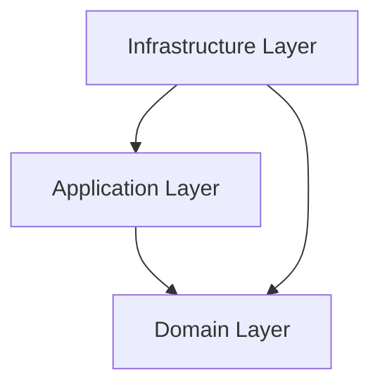

## 왜 이 가이드라인이 중요한가?

좋은 디자인의 일부는 코드에 드러난다. 클래스 이름, 의존성, 인터페이스 같은 것들이다. 그러나 **왜 이렇게 디자인했는지**(rationale), **무엇을 트레이드오프했는지**, **다른 대안은 무엇이었는지**는 코드에 적히지 않는다.

6개월 뒤에 다른 개발자(혹은 미래의 자신)가 다음 코드를 본다고 하자.

```cpp
class OrderService {
    IOrderRepository& repo_;
    ILogger&         log_;
    IEventBus&       events_;
    // ...
};
```

이 코드를 보고 *"왜 EventBus가 필요한가? 왜 직접 호출하지 않는가?"* 라는 질문이 나온다. 답을 모르는 상태로 코드를 고치면 디자인이 깨진다.

**아키텍처 문서**가 답이다. 코드의 의도와 결정을 별도 문서로 남긴다. Iglberger는 이때 **간결한 문서**를 강조한다. UML 100쪽이 아니라 ADR 한 페이지다.

## 핵심 내용

- 코드는 **무엇(what)** 을 보여 주고, 문서는 **왜(why)** 를 보존한다.
- 간결한 문서가 유지되고 진화한다.
- **Architecture Decision Records(ADR)** — 결정의 기록.
- **C4 모델** — Context, Container, Component, Code 네 단계 다이어그램.
- 코드와 동기화가 되지 않으면 문서는 무가치하다.

## 비교 — 문서가 없을 때와 있을 때

### Bad — 문서가 없다

```cpp
class OrderService {
    IOrderRepository& repo_;
    IEventBus&        events_;
public:
    void place(Order o) {
        repo_.persist(o);
        events_.publish(OrderPlacedEvent{o.id()});
    }
};
```

6개월 뒤에 새 개발자가 떠올릴 질문은 이렇다.

- 왜 EventBus가 필요한가? 다른 서비스를 직접 호출하면 안 됐을까?
- 왜 비동기인가? 동기로 처리해도 되지 않았나?
- repo와 events를 repository 하나로 통합하면 안 됐나?

답이 없으니 잘못 변경한다.

### Good — ADR로 결정을 기록한다

```markdown
# ADR-005: Use EventBus for Cross-Service Notification

## Status
Accepted (2025-08)

## Context
주문이 처리되면 Email, Inventory, Analytics 서비스가 알아야 한다.
직접 호출(synchronous, point-to-point)도 가능하지만 다음 문제가 있다.

- OrderService가 모든 downstream 서비스를 알아야 한다(강결합).
- 한 서비스의 실패가 Order의 실패가 된다(불가용성).
- 새 알림 대상이 늘어날 때마다 OrderService를 손봐야 한다.

## Decision
EventBus를 pub/sub 추상화로 둔다. OrderService는 event만 발행한다.
downstream 서비스가 자기 책임으로 subscribe한다.

## Consequences
+ 새 알림 대상 추가에 OrderService를 손대지 않는다.
+ downstream의 실패가 OrderService에 영향을 주지 않는다.
+ 비동기 — eventual consistency를 받아들인다.
- 인프라(EventBus 구현, 메시지 큐)가 추가된다.
- 디버깅 복잡도가 올라간다(분산 trace가 필요하다).

## Alternatives Considered
1. Direct synchronous calls — 강결합 (rejected)
2. Message queue (Kafka) — 현재 규모에는 과하다
3. In-process Observer 패턴 — 다중 서비스 환경에 부적합

## References
- 가이드라인 25 (Observer)
- Internal Wiki: System Architecture Overview
```

이제 새 개발자가 의도를 분명히 알고, 트레이드오프를 인지하며, 변경할 때 결정을 깨지 않게 된다.

## Architecture Decision Records (ADR)

ADR은 가장 가벼우면서도 효과적인 문서 형식이다.

### ADR 표준 구조

```markdown
# ADR-NNN: <결정 제목>

## Status
Draft / Proposed / Accepted / Deprecated / Superseded by ADR-MMM

## Context
배경, 문제, 제약 조건

## Decision
무엇을 선택했는지(한 문단)

## Consequences
+ 긍정적 결과
- 부정적 결과

## Alternatives Considered
다른 옵션과 — 왜 rejected였는지
```

### ADR 위치

```
project/
└── docs/
    └── architecture/
        ├── 001-use-postgres-for-primary-store.md
        ├── 002-event-driven-for-notifications.md
        ├── 003-graphql-for-api-gateway.md
        └── ...
```

git에 코드와 함께 두고 PR로 ADR을 추가하거나 변경한다.

### ADR 도구

- **adr-tools** — CLI로 ADR을 생성하고 관리한다.
- **MADR(Markdown Architecture Decision Records)** — 표준 템플릿.
- **plantuml + ADR** — 다이어그램과 결합한다.

## C4 Model — 4단계 다이어그램

Simon Brown의 아키텍처 시각화 모델로, 네 단계의 추상화로 나눈다.

### Level 1 — System Context

```
            ┌──────────────┐
   User ──→ │ Order System │ ──→ Payment Provider
            │              │ ──→ Email Service
            └──────────────┘
```

시스템 자체와 외부 actor / 시스템의 관계만 보여 준다.

### Level 2 — Container

```
┌─ Order System ──────────────────────────┐
│  ┌────────┐    ┌────────┐    ┌────────┐ │
│  │ Web    │ ──→│ API    │ ──→│ DB     │ │
│  │ App    │    │ Server │    │        │ │
│  └────────┘    └────────┘    └────────┘ │
└─────────────────────────────────────────┘
```

시스템 안의 큰 단위(앱, 서비스, DB, 메시지 큐)를 본다.

### Level 3 — Component

```
┌─ API Server ──────────────────────┐
│  ┌──────────┐  ┌──────────┐       │
│  │ Order    │→ │ Order    │       │
│  │Controller│  │ Service  │       │
│  └──────────┘  └────┬─────┘       │
│                     ↓             │
│                ┌──────────┐       │
│                │ Order    │       │
│                │Repository│       │
│                └──────────┘       │
└───────────────────────────────────┘
```

컨테이너 안의 컴포넌트(클래스나 모듈)를 본다.

### Level 4 — Code

```
class diagram (UML)
```

코드 수준의 실제 클래스. 종종 생략한다(코드 자체로 충분하다).

## 문서의 네 청중

| 청중 | 필요한 정보 |
| --- | --- |
| **새 개발자** | 시스템 개요, 어디서부터 시작할지 |
| **기존 개발자** | 결정의 이유, 트레이드오프 |
| **stakeholder / PM** | 무엇이 가능하고 불가능한지 |
| **아키텍트** | 큰 그림, 의존성 |

한 문서가 모든 청중을 만족시킬 필요는 없다. 청중별로 문서를 분리한다.

## 무엇을 문서화할까

### 가치 있는 문서

- **결정의 이유** — 왜 이 패턴? 왜 이 라이브러리?
- **트레이드오프** — 선택의 비용
- **암묵 계약** — 코드에 드러나지 않는 약속
- **의존성 방향** — 이것이 저것에 의존한다
- **데이터 흐름** — 시스템 간 데이터 이동
- **비기능 요구사항** — 성능, 보안, 가용성

### 가치 없는(또는 적은) 문서

- **메서드 시그니처** — 코드에 이미 있고, IDE도 보여 준다.
- **자명한 동작** — "이 함수는 +를 계산합니다" 같은 것.
- **구현 디테일** — 자주 바뀌므로 문서가 stale해진다.

## 함정 — 문서가 코드와 어긋난다

```markdown
# OrderService 사용법
OrderService::processOrder()를 호출하세요.
```

```cpp
class OrderService {
    void place_order(Order&);     // ⚠️ 메서드 이름이 다르다
};
```

코드가 바뀌어도 문서가 갱신되지 않으면 stale 문서가 된다. 차라리 없는 게 낫다.

규칙은 단순하다.

- 코드에서 추출 가능한 건 코드에 둔다(Doxygen 등).
- 자주 바뀌는 건 문서화하지 않는다.
- 결정의 이유처럼 한 번 적으면 잘 바뀌지 않는 것만 문서로 남긴다.

## 코드 자체가 문서다 — Self-documenting

```cpp
// Bad — 주석에 의존한다
// 사용자가 18세 이상인지 검사
if (user.age >= 18) { /* ... */ }

// Good — 의미 있는 이름
if (user.is_adult()) { /* ... */ }

// Good — 명시적 상수
constexpr int LegalAdultAge = 18;
if (user.age() >= LegalAdultAge) { /* ... */ }
```

코드를 도메인 어휘로 쓰면 자명한 코드에 주석을 달 필요가 줄어든다.

## Doxygen — 코드 안의 문서

```cpp
/// Persists an order to the repository.
///
/// @param order The order to persist. Must have a valid id.
/// @pre order.id() != 0
/// @post repo contains order
/// @throws std::runtime_error if persistence fails
///
/// @see OrderRepository
void persist(const Order& order);
```

Doxygen은 public API의 자동 문서다. 코드와 같은 파일에 둔다.

```bash
doxygen Doxyfile     # 자동으로 HTML 문서를 생성한다
```

장점은 다음과 같다.

- 코드와 함께 있으니 동기화가 쉽다.
- 인터페이스 명세와 의도를 함께 적는다.
- IDE의 호버에 그대로 노출된다.

단점도 있다.

- 구현 디테일은 여전히 stale 위험이 있다.
- 너무 자세하면 코드 가독성이 떨어진다.

## README — 시작점

```markdown
# Project Name

## What
한 문단 — 시스템이 하는 일

## Why
한 문단 — 왜 존재하는가

## How to Build
```bash
cmake -B build && cmake --build build
```

## How to Run
...

## Architecture
간단한 다이어그램 또는 ADR 폴더 링크

## Contributing
PR 절차

## License
```

새 개발자가 README를 읽고 30분 안에 빌드와 실행을 마칠 수 있어야 한다.

## 다이어그램 도구

- **PlantUML** — 텍스트 기반(git 친화적)
- **Mermaid** — Markdown에 임베드
- **Draw.io / Lucidchart** — 그래픽 UI
- **Excalidraw** — 손그림 느낌

텍스트 기반 도구(PlantUML, Mermaid)가 git diff와 code review에 어울린다.



## 라이프타임 / 시퀀스 다이어그램

```
Client            Service           Database
  │                  │                  │
  │── place_order ──→│                  │
  │                  │── persist ──────→│
  │                  │←── ack ──────────│
  │                  │── publish event ─→ EventBus
  │←── confirmation ─│                  │
```

복잡한 흐름은 sequence diagram이 잘 맞는다.

## 의존성 다이어그램

```
domain (의존 없음)
  ↑
application
  ↑
infrastructure → external libraries
       ↑
   main / DI container
```

레이어드 아키텍처에서 의존 방향을 그린다. 가이드라인 9를 시각화한 그림이다.

## 비기능 요구사항(NFR)

```markdown
## Performance
- API latency p99 < 100ms
- Throughput: 1000 RPS

## Availability
- 99.9% uptime
- Graceful degradation on dependency failure

## Security
- All data at rest encrypted
- TLS 1.3 for transport
- JWT auth, 1h expiry

## Scalability
- Horizontal scaling — stateless services
- DB read replicas
```

코드에는 드러나지 않는 요구사항을 문서에 적어 둔다.

## 함정 — Big Design Up-Front

```
프로젝트 시작 시 — 100쪽짜리 디자인 문서
   ↓
실제 코딩에 들어가면 디자인이 현실과 어긋난다
   ↓
문서가 무시되고 stale해진다
```

Agile의 원칙은 단순하다. 문서는 **필요한 만큼만** 작성한다. 시스템이 진화하면 문서도 같이 진화한다.

- 작게 시작한다 — README와 핵심 ADR 몇 개.
- 결정이 생길 때마다 ADR을 더한다.
- 큰 변화가 일어나면 다이어그램을 갱신한다.
- stale 문서는 즉시 삭제하거나 수정한다.

## 함정 — UML 의식(儀式)

```
프로젝트 시작 → UML 클래스 다이어그램 50장
구현 시작 → UML과 어긋나기 시작
6개월 뒤 → UML 폴더는 그대로, 코드는 다른 방향으로 흘러간다
```

UML은 소통 도구일 때만 가치가 있다. 자세한 클래스 다이어그램은 코드 자체와 IDE의 클래스 뷰가 더 정확하다. 시스템 수준 다이어그램(Container, Component)에 집중하자.

## ADR 예시 — 실전

```markdown
# ADR-012: Adopt std::variant over Inheritance for Message Types

## Status
Accepted (2026-01-15)

## Context
네트워크 프로토콜에서 여러 메시지 타입을 다뤄야 한다.
- HandshakeMsg, DataMsg, AckMsg, ErrorMsg, ...
- 메시지 수는 프로토콜로 정해져 있어 고정이다.
- 새 연산은 자주 추가된다 — parse, serialize, log, validate, route.

옵션은 다음과 같다.
1. Class hierarchy: `class Message; class HandshakeMsg : public Message;`
2. `std::variant<HandshakeMsg, DataMsg, AckMsg, ErrorMsg>`

## Decision
`std::variant`를 채택한다. 이유는 다음과 같다.
- 메시지 타입이 프로토콜로 고정된 closed set이다.
- 새 연산 추가가 빈번하고, variant + visit이 OCP를 잘 만족한다.
- vtable 비용을 피할 수 있다(임베디드 환경).
- 값 의미론 — heap 할당이 없다.

## Consequences
+ 새 연산 추가가 비-멤버 함수로 끝난다. 기존 메시지 클래스는 손대지 않는다.
+ 모든 케이스를 컴파일러가 검증해 준다(누락 시 에러).
+ 성능 — vtable 없음, 임베디드 친화.
- 새 메시지 타입을 더할 때 variant와 모든 visit을 수정해야 한다(드물게 일어난다).
- 코드 부피 — 각 visit이 컴파일 타임에 분기된다.

## Alternatives Considered
- **Inheritance**: 새 연산마다 base 인터페이스를 손봐야 한다 → 모든 derived 수정. OCP 위반.
- **Type erasure (std::function)**: 런타임 비용과 타입 정보 손실이 따른다.
- **Tagged union (C-style)**: 타입 안전성이 부족하다.

## References
- 가이드라인 5 (Design for Extension)
- 가이드라인 15 (Visitor design)
- Iglberger Ch 4
```

## 도구

문서 관리에 자주 쓰는 도구는 다음과 같다.

- **Markdown + git** — 가장 단순하고 가장 권장된다.
- **Confluence / Notion** — 협업 친화적인 위키 스타일.
- **MkDocs / Docusaurus** — 문서 사이트 생성기.
- **README + ADR + Doxygen** — 표준 조합.

## 실무 가이드 — 문서를 시작할 때

새 프로젝트를 시작할 때 필요한 최소 세트는 이렇다.

1. **README.md** — what / why / how to build / how to run.
2. **`docs/architecture/`** — ADR 폴더(첫 결정부터).
3. **상위 다이어그램** — C4 Container 수준 이상.
4. **`CONTRIBUTING.md`** — 새 개발자 onboarding.

작은 프로젝트라면 이 정도로 충분하다.

## 실무 가이드 — 체크리스트

- [ ] README만으로 새 개발자가 30분 안에 빌드와 실행을 마칠 수 있는가?
- [ ] 큰 디자인 결정이 ADR로 기록되어 있는가?
- [ ] 의존성 방향이 다이어그램에 드러나는가?
- [ ] 외부 시스템과의 인터페이스가 명시되어 있는가?
- [ ] 비기능 요구사항이 문서화되어 있는가?
- [ ] stale 문서를 즉시 처리(수정 또는 삭제)하는가?
- [ ] 문서가 코드와 동기화되도록 구조화되어 있는가?

## 정리

코드는 **what**이고 문서는 **why**다. 큰 시스템에서는 둘 다 필요하다.

원칙은 다음과 같다.

1. 간결하게 쓴다. 100쪽 UML보다 한 페이지 ADR이 낫다.
2. 잘 변하지 않는 것만 적는다. 자명한 코드나 구현 디테일은 적지 않는다.
3. 결정의 이유가 가장 가치 있는 문서다.
4. stale은 즉시 처리한다. 잘못된 문서는 없는 것보다 나쁘다.

도구는 이렇게 정리할 수 있다.

- **ADR** — 결정 기록
- **C4 Model** — 4단계 다이어그램
- **README** — 시작점
- **Doxygen** — API 문서
- **PlantUML / Mermaid** — 텍스트 다이어그램

## 관련 항목

- [가이드라인 1: 디자인의 중요성](/blog/programming/cpp/cpp-software-design/guideline01-understand-the-importance-of-software-design) — 디자인 결정의 영향
- [가이드라인 9: 추상화 소유권](/blog/programming/cpp/cpp-software-design/guideline09-pay-attention-to-the-ownership-of-abstractions) — 의존성 다이어그램
- [가이드라인 14: 패턴 이름으로 의도 전달](/blog/programming/cpp/cpp-software-design/guideline14-use-a-design-patterns-name-to-communicate-intent) — 패턴 이름도 일종의 문서다
